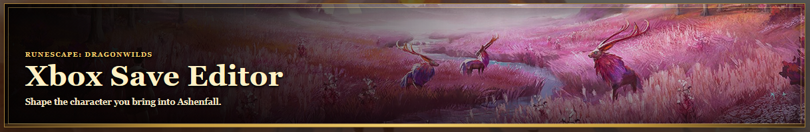
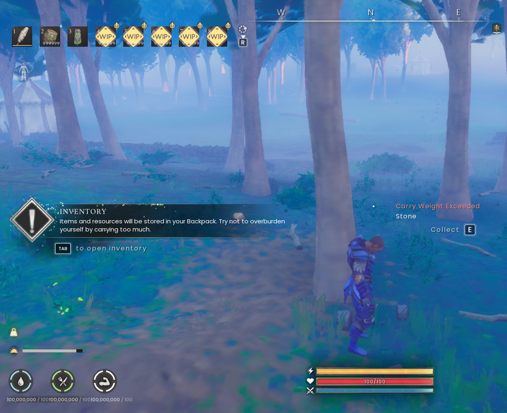
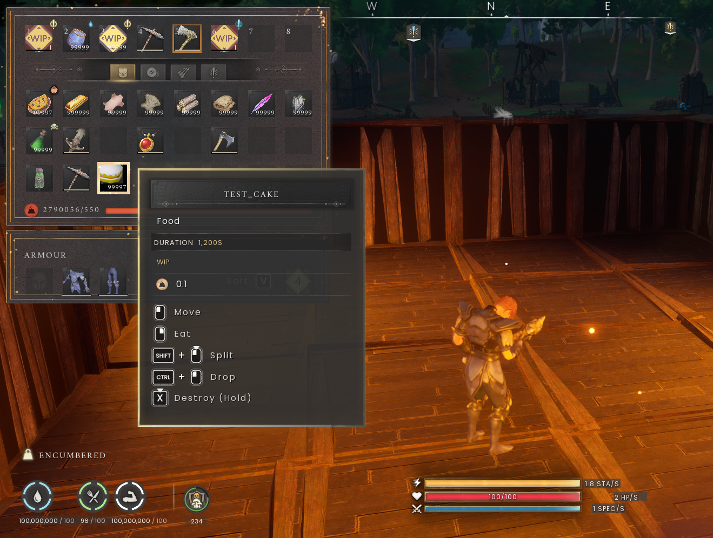
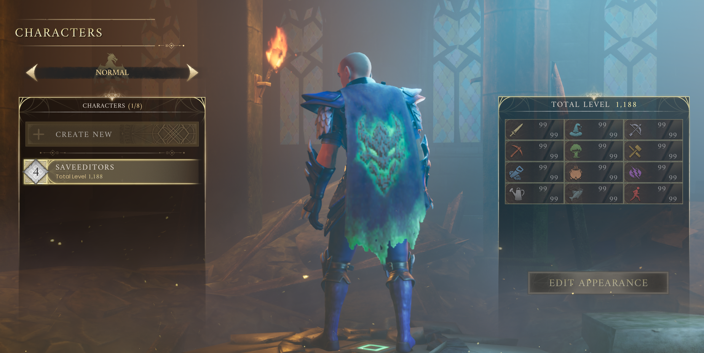

# Dragonwilds Save Editor (Xbox)

A browser-only character save editor for **RuneScape: Dragonwilds**, built for Xbox saves. Open `index.html` in any modern browser — or visit the live site once deployed.

**Trust:** everything runs locally in your browser. Your save file is never uploaded anywhere. There are no accounts, no servers, no scripts to run.

## Try it first

Click **Preview demo** on the start screen to explore the full editor with a synthetic "Demo Adventurer" character — no save file needed. Demo mode is clearly badged, and downloading is disabled there so demo output can never be confused with a real save.

## What you can edit

- **Inventory** — four fixed sections (Main inventory, Rune pouch, Arrows, Quest items), quantities up to 999999, equipment durability, add/remove across slot ranges
- **Quick-use bar** — the 8 hotbar positions, editing Inventory slots 0–7 directly
- **Vitals** — health, stamina, special charge, endurance, food, water, and grace periods (up to 100000000, each with a Max button), plus curing harmful conditions
- **Skills** — XP and levels for all 12 skills, with bulk actions
- **Gear** — equip directly into head, body, legs, cape, and trinket slots, with equip-from-inventory and unequip-to-inventory
- **Recipes, journal, conditions, appearance** — full coverage with the same preserve-everything guarantees
- **Safe quick actions** — restore all vitals, cure conditions, max skills, repair equipment, fill all runes to max, with plain-language summaries of exactly what changed

Every edit preserves unknown save data, key order, tab indentation, the `Backup` field, and character identity fields. Unexpected save versions produce a warning, never a silent failure.

## Real names, honest unknowns

Item, perk, recipe, and journal names come from the game's own files and community research — never guessed. The editor shows a resolved/missing count at the top of every section. Anything without a reliable name stays untouched and is counted honestly instead of being faked. Internal IDs, hashes, and stack GUIDs are hidden from the normal UI (available under Advanced/raw).

Item descriptions are the game's own text, word for word. Items with no description in the game files show their item type and a wiki link instead of invented flavor text.

## Test and placeholder items

The game data contains developer test records such as **TEST_Cake** (visible in-game below with its `WIP` label) and `[PH]` placeholder items like the Abysal Lantern and Gatekeeper Greatsword. These are unshipped internal items, not real gameplay items, so the editor hides them from the item picker and search by default. A clearly labeled toggle — "Show unconfirmed placeholder items" — reveals them if you want to experiment.

## Dragonbane Cape (Alpha Cape)

The editor can write the **Dragonbane Cape (Alpha Cape)** directly into your cape slot. This is labeled honestly in the editor:

- It **renders and works at the main menu** (verified: green dragon emblem visible).

- The game runs an **entitlement check when you join any world** — including solo — and unequips it. There is no entitlement field anywhere in the character save, so this cannot be bypassed from the save.
- The cape **stays in your inventory** afterward; nothing is lost.

## Xbox saves

> **Close the game fully before swapping a save.** Quit the Dragonwilds app entirely — returning to the main menu is not enough. Then locate the **fresh** save container: Xbox changes the WGS container ID every session, so the folder you used last time will not be the right one. Swapping a file while the game is still running (or into a stale container) can cause the replacement to not register, and the game may overwrite or ignore it.

To get your save: paste `%LOCALAPPDATA%\Packages` into File Explorer's address bar, find the folder starting with `JagexLimited.Dominion_`, open `SystemAppData\wgs`, and copy the extensionless save file somewhere safe. Load that copy with **Browse for Save File**. After editing, download the file and sync it back through the Xbox cloud the same way you pulled it.

A modified save completing a full Xbox cloud-sync round trip (inventory, skills, armor, and name edits) has been verified working.
